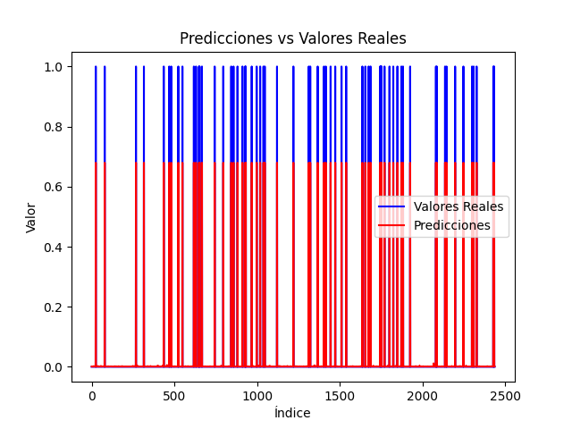

# Artificial Neural Network from Scratch (Python)

This project is a custom implementation of a **Multilayer Perceptron (MLP)** built from the ground up in Python using only the `NumPy` library. 

By avoiding high-level frameworks like TensorFlow or PyTorch, this project showcases a deep understanding of AI fundamentals, including the manual development of the **Backpropagation** algorithm and gradient descent optimization.

## 🚀 Key Features
* [cite_start]**Modular Architecture**: Clean, object-oriented design with independent classes for Neurons, Layers, and the Neural Network[cite: 1, 2, 6, 7].
* [cite_start]**Manual Mathematics**: Implementation of the Sigmoid activation function and automated weight updates[cite: 1, 6].
* [cite_start]**Data Versatility**: Capable of processing and classifying diverse datasets such as Iris, Mushrooms, and Penguins[cite: 2, 9, 12, 13].

## 📊 Training & Convergence
The training process is visualized through the reduction of the Mean Squared Error (MSE). Below are the convergence plots from different training sessions:

| Session 1: Initial Loss | Session 2: Fine-tuning |
| :---: | :---: |
|  |  |
| *Initial error reduction* | *Stability after convergence* |

## 🎯 Results & Predictions
The network achieves high accuracy in binary classification (e.g., distinguishing poisonous vs. edible mushrooms). The following plot compares the model's predictions against the actual ground truth from the test set.

*Comparison between real test labels (blue) and neural network predictions (red).*

## 🛠️ Tech Stack
* **Python 3.11**
* [cite_start]**NumPy**: For high-performance matrix operations[cite: 1, 6].
* [cite_start]**Pandas**: For data engineering and One-Hot Encoding[cite: 4, 9].
* [cite_start]**Matplotlib**: For plotting training progress and results[cite: 4, 9].

## 📂 Project Structure
* `src/`: Core logic (`Neuron.py`, `Layer.py`, `NeuralNetwork.py`).
* `data/`: Source CSV datasets.
* `results/`: Training and prediction plots.
* [cite_start]`main.py`: Main execution script with performance metrics (Accuracy, Precision, F1-Score)[cite: 4, 9].
